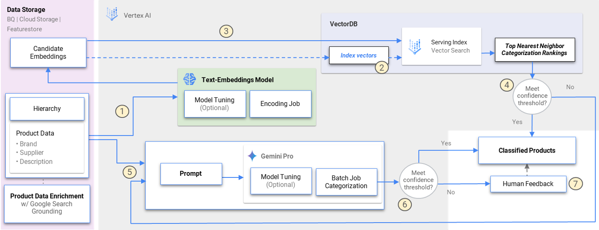

# vtt-taxonomy-categorization

This project demonstrates an effective approach for categorizing products within a hierarchical taxonomy by utilizing semantic similarity matching with text embeddings and Vertex AI Matching Engine. Using the product taxonomy as well as labeled/unlabeled datasets, the goal is to accurately classify products into their respective categories based on their textual descriptions. These techniques provide a robust foundation for building automated product categorization systems or enhancing existing workflows.

## Getting started

Once the prerequisites have been met and the user parameters are specified, users can follow the notebook to run through the guided steps.

### Notebooks

The notebook is self-contained and can be run independently.

* [taxonomy-categorization.ipynb](./taxonomy-categorization.ipynb) : This notebook demonstrates a taxonomy categorization use case, leveraging text embeddings and Vertex AI Vector Search to efficiently classify items based on their textual descriptions

### Prerequisites

Ensure the project environment, network settings, and service accounts used have the appropriate google cloud authentication and permissions to access the folloiwng services:
- `Vertex AI`
- `Cloud Storage`

## Workflow

This sample architecture demonstrates a workflow for building a semantic search system using vector embeddings. The process involves preparing embeddings from preprocessed hierarchy and inventory data, creating and deploying a vector database index, and performing inference and ranking to retrieve relevant results.

This system is flexible and can be deployed in both online and offline environments, allowing for customization depending on your specific requirements.

The embedding process detailed in this repository is a component of a broader categorization workflow. It offers a scalable and potentially cost-effective approach to complement methods such as LLM (Large Language Model) classification, for improved accuracy and efficiency.

## Resources

* https://cloud.google.com/vertex-ai/docs/vector-search/overview
* https://cloud.google.com/vertex-ai/generative-ai/docs/embeddings
* https://cloud.google.com/vertex-ai/generative-ai/docs/models/tune-embeddings

Copyright 2024 Google, LLC. This software is provided as-is, without warranty or representation for any use or purpose. Your use of it is subject to your agreement with Google.
Licensed under the Apache License, Version 2.0 (the "License"); you may not use this file except in compliance with the License. You may obtain a copy of the License at

http://www.apache.org/licenses/LICENSE-2.0
